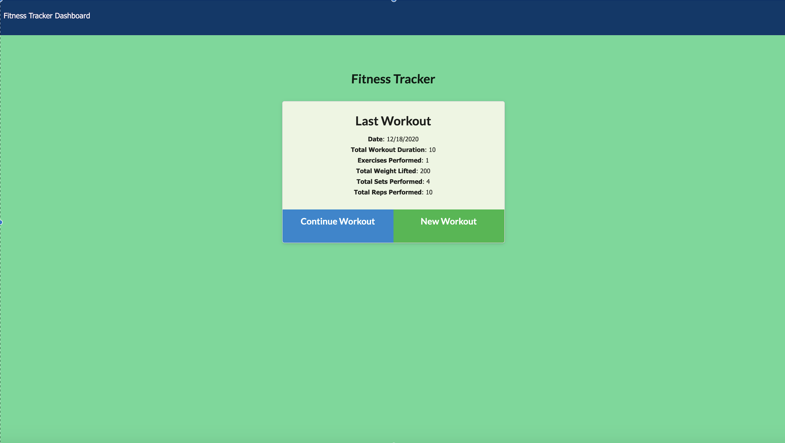
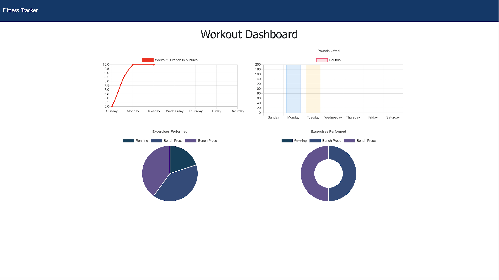

# Workout Tracker

This is a workout tracker that handles the following criteria:

* At the landing page, the user is given the option to create new workout or continue with their previous workout. 

* The user is also able to add exercises to a previous workout plan or add new exercises to a new workout plan.

* Lastly, the user is able to view the combined weight of multiple exercises on the `stats` page.

## Development and Production

* This app is deployed with MongoDB Atlas and Heroku. 

## Final Product and Link 

* Click here to test the app 

https://boiling-plateau-19552.herokuapp.com/?id=5fdccac7ff779200170f16da

